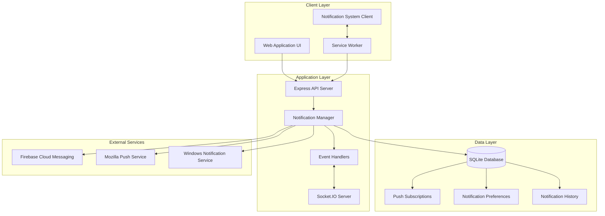

# 🔔 Capital Ladder Push Notification System - Technical Architecture

## Document Information

- **System**: Capital Ladder Push Notification Service
- **Version**: 1.0
- **Created**: 2025-09-15
- **Architect**: Development Team
- **Review Status**: Draft

## System Overview

### Architecture Principles

1. **Native Web APIs First** - Leverage browser-native Push API for maximum
   compatibility
2. **Progressive Enhancement** - Graceful degradation for unsupported browsers
3. **Privacy by Design** - User consent and granular control over notifications
4. **Event-Driven Architecture** - Seamless integration with existing Socket.IO
   infrastructure
5. **Scalable Design** - Support for future growth and additional notification
   channels

### High-Level Architecture



## Component Architecture

### 1. Client-Side Components

#### 1.1 Service Worker (`public/sw.js`)

```javascript
// Core service worker architecture
class NotificationServiceWorker {
  constructor() {
    this.CACHE_NAME = 'capital-ladder-notifications-v1';
    this.API_BASE = self.location.origin;
  }

  async install() {
    // Cache notification assets
    const cache = await caches.open(this.CACHE_NAME);
    await cache.addAll([
      '/icons/challenge-icon.png',
      '/icons/match-icon.png',
      '/icons/badge-icon.png'
    ]);
  }

  async handlePush(event) {
    const data = event.data ? event.data.json() : {};
    await this.showNotification(data);
  }

  async handleNotificationClick(event) {
    event.notification.close();

    if (event.action) {
      await this.handleNotificationAction(
        event.action,
        event.notification.data
      );
    } else {
      await this.openApp(event.notification.data.actionUrl);
    }
  }

  async handleNotificationAction(action, data) {
    // Handle accept/decline actions
    const response = await fetch(
      `${this.API_BASE}/api/challenges/${data.challengeId}/${action}`,
      {
        method: 'POST',
        headers: { 'Content-Type': 'application/json' },
        body: JSON.stringify({ actionSource: 'notification' })
      }
    );

    if (response.ok) {
      await this.showConfirmationNotification(action, data);
    }
  }
}
```

#### 1.2 Notification Client Manager (`public/js/notification-manager.js`)

```javascript
class NotificationManager {
  constructor() {
    this.registration = null;
    this.subscription = null;
    this.isSupported = this.checkSupport();
  }

  checkSupport() {
    return (
      'serviceWorker' in navigator &&
      'PushManager' in window &&
      'Notification' in window
    );
  }

  async initialize() {
    if (!this.isSupported) {
      console.warn('Push notifications not supported');
      return false;
    }

    try {
      this.registration = await navigator.serviceWorker.register('/sw.js');
      await this.setupUpdateListener();
      return true;
    } catch (error) {
      console.error('Service worker registration failed:', error);
      return false;
    }
  }

  async requestPermission() {
    if (Notification.permission === 'granted') return true;
    if (Notification.permission === 'denied') return false;

    const permission = await Notification.requestPermission();
    return permission === 'granted';
  }

  async subscribe() {
    if (!this.registration || !(await this.requestPermission())) return null;

    try {
      const subscription = await this.registration.pushManager.subscribe({
        userVisibleOnly: true,
        applicationServerKey: await this.getVAPIDPublicKey()
      });

      await this.sendSubscriptionToServer(subscription);
      this.subscription = subscription;
      return subscription;
    } catch (error) {
      console.error('Push subscription failed:', error);
      return null;
    }
  }
}
```

### 2. Server-Side Components

#### 2.1 Notification Service Layer (`lib/notification-service.js`)

```javascript
const webpush = require('web-push');
const { PrismaClient } = require('@prisma/client');

class NotificationService {
  constructor() {
    this.prisma = new PrismaClient();
    this.setupWebPush();
  }

  setupWebPush() {
    webpush.setVapidDetails(
      'mailto:admin@capitolladder.com',
      process.env.VAPID_PUBLIC_KEY,
      process.env.VAPID_PRIVATE_KEY
    );
  }

  async sendNotification(userId, payload) {
    try {
      // Get user subscriptions
      const subscriptions = await this.getUserSubscriptions(userId);

      // Check user preferences
      const preferences = await this.getUserPreferences(userId);
      if (!this.shouldSendNotification(payload.type, preferences)) {
        return { success: false, reason: 'User preferences' };
      }

      // Send to all user subscriptions
      const results = await Promise.allSettled(
        subscriptions.map(sub => this.sendToSubscription(sub, payload))
      );

      // Record in history
      await this.recordNotification(userId, payload, results);

      return this.summarizeResults(results);
    } catch (error) {
      console.error('Notification send failed:', error);
      throw error;
    }
  }

  async sendToSubscription(subscription, payload) {
    const pushPayload = {
      title: payload.title,
      body: payload.body,
      icon: '/icons/badge-icon.png',
      badge: '/icons/badge-icon.png',
      tag: payload.tag,
      data: payload.data,
      actions: payload.actions || []
    };

    return await webpush.sendNotification(
      {
        endpoint: subscription.endpoint,
        keys: {
          p256dh: subscription.keys_p256dh,
          auth: subscription.keys_auth
        }
      },
      JSON.stringify(pushPayload)
    );
  }

  async getUserSubscriptions(userId) {
    return await this.prisma.pushSubscription.findMany({
      where: { userId }
    });
  }

  async getUserPreferences(userId) {
    let preferences = await this.prisma.notificationPreferences.findUnique({
      where: { userId }
    });

    if (!preferences) {
      // Create default preferences
      preferences = await this.prisma.notificationPreferences.create({
        data: {
          userId,
          challengesEnabled: true,
          matchesEnabled: true,
          systemEnabled: true
        }
      });
    }

    return preferences;
  }

  shouldSendNotification(type, preferences) {
    if (!preferences) return true;

    // Check quiet hours
    if (this.isQuietHours(preferences)) return false;

    // Check type-specific preferences
    switch (type) {
      case 'challenge':
        return preferences.challengesEnabled;
      case 'match':
        return preferences.matchesEnabled;
      case 'system':
        return preferences.systemEnabled;
      default:
        return true;
    }
  }

  isQuietHours(preferences) {
    if (!preferences.quietHoursStart || !preferences.quietHoursEnd)
      return false;

    const now = new Date();
    const currentTime = now.getHours() * 100 + now.getMinutes();

    const startTime = this.timeToNumber(preferences.quietHoursStart);
    const endTime = this.timeToNumber(preferences.quietHoursEnd);

    if (startTime < endTime) {
      return currentTime >= startTime && currentTime <= endTime;
    } else {
      // Quiet hours span midnight
      return currentTime >= startTime || currentTime <= endTime;
    }
  }
}
```

#### 2.2 Event Integration Layer (`lib/notification-events.js`)

```javascript
class NotificationEventHandler {
  constructor(notificationService, io) {
    this.notificationService = notificationService;
    this.io = io;
    this.setupEventListeners();
  }

  setupEventListeners() {
    // Challenge events
    this.io.on('challengeCreated', this.handleChallengeCreated.bind(this));
    this.io.on('challengeAccepted', this.handleChallengeAccepted.bind(this));
    this.io.on('challengeDeclined', this.handleChallengeDeclined.bind(this));
    this.io.on('challengeProposed', this.handleChallengeProposed.bind(this));

    // Match events
    this.io.on('matchStarting', this.handleMatchStarting.bind(this));
    this.io.on('matchCompleted', this.handleMatchCompleted.bind(this));
    this.io.on('matchInvitation', this.handleMatchInvitation.bind(this));
  }

  async handleChallengeCreated(data) {
    const { challengeId, targetUserId, creatorName, discipline, gamesToWin } =
      data;

    const payload = {
      type: 'challenge',
      title: `New Challenge from ${creatorName}`,
      body: `${discipline}, First to ${gamesToWin} games`,
      tag: `challenge-${challengeId}`,
      data: {
        type: 'challenge',
        challengeId,
        actionUrl: `/challenges/${challengeId}`
      },
      actions: [
        { action: 'accept', title: 'Accept', icon: '/icons/accept-icon.png' },
        { action: 'decline', title: 'Decline', icon: '/icons/decline-icon.png' }
      ]
    };

    await this.notificationService.sendNotification(targetUserId, payload);
  }

  async handleChallengeAccepted(data) {
    const { challengeId, creatorId, accepterName } = data;

    const payload = {
      type: 'challenge',
      title: 'Challenge Accepted!',
      body: `${accepterName} accepted your challenge`,
      tag: `challenge-response-${challengeId}`,
      data: {
        type: 'challenge-response',
        challengeId,
        actionUrl: `/challenges/${challengeId}`
      }
    };

    await this.notificationService.sendNotification(creatorId, payload);
  }

  async handleMatchStarting(data) {
    const { matchId, players, startsIn } = data;

    for (const playerId of players) {
      const payload = {
        type: 'match',
        title: 'Match Starting Soon',
        body: `Your match starts in ${startsIn} minutes`,
        tag: `match-reminder-${matchId}`,
        data: {
          type: 'match-reminder',
          matchId,
          actionUrl: `/matches/${matchId}`
        }
      };

      await this.notificationService.sendNotification(playerId, payload);
    }
  }

  async handleMatchCompleted(data) {
    const { matchId, winnerId, loserId, winnerName, score } = data;

    // Notify winner
    await this.notificationService.sendNotification(winnerId, {
      type: 'match',
      title: 'Match Victory!',
      body: `You won ${score}! Well played!`,
      tag: `match-result-${matchId}`,
      data: { type: 'match-result', matchId, result: 'win' }
    });

    // Notify loser
    await this.notificationService.sendNotification(loserId, {
      type: 'match',
      title: 'Match Complete',
      body: `${winnerName} won ${score}. Better luck next time!`,
      tag: `match-result-${matchId}`,
      data: { type: 'match-result', matchId, result: 'loss' }
    });
  }
}
```

### 3. Database Schema Design

#### 3.1 Prisma Schema Extensions

```prisma
model PushSubscription {
  id          String   @id @default(cuid())
  userId      String
  user        User     @relation(fields: [userId], references: [id])
  endpoint    String   @unique
  p256dh      String   // keys.p256dh
  auth        String   // keys.auth
  userAgent   String?
  createdAt   DateTime @default(now())
  updatedAt   DateTime @updatedAt

  @@map("push_subscriptions")
}

model NotificationPreferences {
  id                String   @id @default(cuid())
  userId            String   @unique
  user              User     @relation(fields: [userId], references: [id])
  challengesEnabled Boolean  @default(true)
  matchesEnabled    Boolean  @default(true)
  systemEnabled     Boolean  @default(true)
  quietHoursStart   String?  // HH:MM format
  quietHoursEnd     String?  // HH:MM format
  createdAt         DateTime @default(now())
  updatedAt         DateTime @updatedAt

  @@map("notification_preferences")
}

model NotificationHistory {
  id        String    @id @default(cuid())
  userId    String
  user      User      @relation(fields: [userId], references: [id])
  type      String    // challenge, match, system
  title     String
  body      String
  data      Json?     // Additional payload data
  sentAt    DateTime  @default(now())
  readAt    DateTime?
  clickedAt DateTime?

  @@map("notification_history")
}

// Add relations to existing User model
model User {
  // ... existing fields
  pushSubscriptions        PushSubscription[]
  notificationPreferences  NotificationPreferences?
  notificationHistory      NotificationHistory[]
}
```

### 4. API Architecture

#### 4.1 REST API Endpoints

**Push Subscription Management**

```javascript
// POST /api/notifications/subscribe
router.post('/subscribe', authMiddleware, async (req, res) => {
  const { subscription } = req.body;
  const userId = req.userId;

  try {
    const existingSubscription = await prisma.pushSubscription.findUnique({
      where: { endpoint: subscription.endpoint }
    });

    if (existingSubscription) {
      return res.json({ success: true, message: 'Already subscribed' });
    }

    await prisma.pushSubscription.create({
      data: {
        userId,
        endpoint: subscription.endpoint,
        p256dh: subscription.keys.p256dh,
        auth: subscription.keys.auth,
        userAgent: req.get('User-Agent')
      }
    });

    res.json({ success: true });
  } catch (error) {
    res.status(500).json({ error: 'Subscription failed' });
  }
});

// DELETE /api/notifications/unsubscribe
router.delete('/unsubscribe', authMiddleware, async (req, res) => {
  const { endpoint } = req.body;

  try {
    await prisma.pushSubscription.deleteMany({
      where: { endpoint, userId: req.userId }
    });
    res.json({ success: true });
  } catch (error) {
    res.status(500).json({ error: 'Unsubscribe failed' });
  }
});
```

**Notification Preferences**

```javascript
// GET /api/notifications/preferences
router.get('/preferences', authMiddleware, async (req, res) => {
  const preferences = await notificationService.getUserPreferences(req.userId);
  res.json(preferences);
});

// PUT /api/notifications/preferences
router.put('/preferences', authMiddleware, async (req, res) => {
  const { challenges, matches, system, quietHours } = req.body;

  const preferences = await prisma.notificationPreferences.upsert({
    where: { userId: req.userId },
    update: {
      challengesEnabled: challenges,
      matchesEnabled: matches,
      systemEnabled: system,
      quietHoursStart: quietHours?.start,
      quietHoursEnd: quietHours?.end
    },
    create: {
      userId: req.userId,
      challengesEnabled: challenges,
      matchesEnabled: matches,
      systemEnabled: system,
      quietHoursStart: quietHours?.start,
      quietHoursEnd: quietHours?.end
    }
  });

  res.json(preferences);
});
```

### 5. Security Architecture

#### 5.1 VAPID Key Management

```javascript
// Environment variables for VAPID keys
VAPID_PUBLIC_KEY=BH8Q...  // Web-safe base64 encoded public key
VAPID_PRIVATE_KEY=7H8...  // Web-safe base64 encoded private key
VAPID_SUBJECT=mailto:admin@capitolladder.com
```

#### 5.2 Content Security Policy

```javascript
// Enhanced CSP for service workers and push
app.use(
  helmet({
    contentSecurityPolicy: {
      directives: {
        defaultSrc: ["'self'"],
        scriptSrc: ["'self'", "'unsafe-inline'"],
        connectSrc: ["'self'", 'https://fcm.googleapis.com', 'wss:'],
        imgSrc: ["'self'", 'data:', 'https:'],
        workerSrc: ["'self'"],
        manifestSrc: ["'self'"]
      }
    }
  })
);
```

#### 5.3 Subscription Validation

```javascript
class SubscriptionValidator {
  static validateSubscription(subscription) {
    if (!subscription || typeof subscription !== 'object') {
      throw new Error('Invalid subscription object');
    }

    if (!subscription.endpoint || !this.isValidURL(subscription.endpoint)) {
      throw new Error('Invalid endpoint');
    }

    if (
      !subscription.keys ||
      !subscription.keys.p256dh ||
      !subscription.keys.auth
    ) {
      throw new Error('Missing required keys');
    }

    // Validate key formats
    if (
      !this.isValidBase64URL(subscription.keys.p256dh) ||
      !this.isValidBase64URL(subscription.keys.auth)
    ) {
      throw new Error('Invalid key format');
    }

    return true;
  }

  static isValidURL(string) {
    try {
      const url = new URL(string);
      return url.protocol === 'https:';
    } catch {
      return false;
    }
  }

  static isValidBase64URL(str) {
    try {
      return btoa(atob(str)) === str;
    } catch {
      return false;
    }
  }
}
```

### 6. Performance Architecture

#### 6.1 Caching Strategy

```javascript
class NotificationCache {
  constructor() {
    this.subscriptionCache = new Map();
    this.preferenceCache = new Map();
    this.CACHE_TTL = 5 * 60 * 1000; // 5 minutes
  }

  async getUserSubscriptions(userId) {
    const cacheKey = `subscriptions:${userId}`;
    const cached = this.subscriptionCache.get(cacheKey);

    if (cached && Date.now() - cached.timestamp < this.CACHE_TTL) {
      return cached.data;
    }

    const subscriptions = await this.fetchFromDatabase(userId);
    this.subscriptionCache.set(cacheKey, {
      data: subscriptions,
      timestamp: Date.now()
    });

    return subscriptions;
  }

  invalidateUserCache(userId) {
    this.subscriptionCache.delete(`subscriptions:${userId}`);
    this.preferenceCache.delete(`preferences:${userId}`);
  }
}
```

#### 6.2 Batch Processing

```javascript
class NotificationQueue {
  constructor(notificationService) {
    this.queue = [];
    this.processing = false;
    this.BATCH_SIZE = 10;
    this.BATCH_DELAY = 100; // ms
  }

  async addNotification(userId, payload) {
    this.queue.push({ userId, payload, timestamp: Date.now() });

    if (!this.processing) {
      this.processBatch();
    }
  }

  async processBatch() {
    this.processing = true;

    while (this.queue.length > 0) {
      const batch = this.queue.splice(0, this.BATCH_SIZE);

      await Promise.allSettled(
        batch.map(item =>
          this.notificationService.sendNotification(item.userId, item.payload)
        )
      );

      if (this.queue.length > 0) {
        await new Promise(resolve => setTimeout(resolve, this.BATCH_DELAY));
      }
    }

    this.processing = false;
  }
}
```

### 7. Monitoring & Analytics

#### 7.1 Metrics Collection

```javascript
class NotificationMetrics {
  constructor() {
    this.metrics = {
      sent: 0,
      delivered: 0,
      failed: 0,
      clicked: 0,
      actioned: 0
    };
  }

  recordSent(count = 1) {
    this.metrics.sent += count;
  }

  recordDelivered(count = 1) {
    this.metrics.delivered += count;
  }

  recordFailed(count = 1) {
    this.metrics.failed += count;
  }

  recordClicked(count = 1) {
    this.metrics.clicked += count;
  }

  recordActioned(count = 1) {
    this.metrics.actioned += count;
  }

  getSuccessRate() {
    return this.metrics.sent > 0
      ? (this.metrics.delivered / this.metrics.sent) * 100
      : 0;
  }

  getClickThroughRate() {
    return this.metrics.delivered > 0
      ? (this.metrics.clicked / this.metrics.delivered) * 100
      : 0;
  }

  getActionRate() {
    return this.metrics.delivered > 0
      ? (this.metrics.actioned / this.metrics.delivered) * 100
      : 0;
  }
}
```

## Integration Points

### 1. Existing Socket.IO Integration

The notification system leverages the existing Socket.IO infrastructure to
trigger push notifications based on real-time events.

### 2. Challenge System Integration

- Hooks into challenge creation, acceptance, and scheduling flows
- Extends existing challenge endpoints with notification triggers
- Maintains backward compatibility with current challenge workflow

### 3. Match System Integration

- Integrates with live match creation and scoring
- Adds match reminder scheduling based on confirmed challenges
- Extends match completion flow with result notifications

### 4. User Authentication Integration

- Uses existing JWT authentication for notification API endpoints
- Associates push subscriptions with authenticated user accounts
- Respects existing user session management

## Deployment Architecture

### 1. Environment Configuration

```bash
# Production environment variables
VAPID_PUBLIC_KEY=BH8Q...
VAPID_PRIVATE_KEY=7H8...
VAPID_SUBJECT=mailto:admin@capitolladder.com
NODE_ENV=production
NOTIFICATION_QUEUE_SIZE=50
NOTIFICATION_RETRY_ATTEMPTS=3
```

### 2. Database Migration

```sql
-- Migration script for notification tables
-- Run with: npm run prisma:migrate
-- File: prisma/migrations/add_notifications/migration.sql

CREATE TABLE push_subscriptions (
  id TEXT PRIMARY KEY,
  user_id TEXT NOT NULL,
  endpoint TEXT NOT NULL UNIQUE,
  keys_p256dh TEXT NOT NULL,
  keys_auth TEXT NOT NULL,
  user_agent TEXT,
  created_at DATETIME DEFAULT CURRENT_TIMESTAMP,
  updated_at DATETIME DEFAULT CURRENT_TIMESTAMP,
  FOREIGN KEY (user_id) REFERENCES User(id) ON DELETE CASCADE
);

CREATE INDEX idx_push_subscriptions_user_id ON push_subscriptions(user_id);
CREATE INDEX idx_push_subscriptions_endpoint ON push_subscriptions(endpoint);

-- Additional tables as defined in schema...
```

### 3. Service Worker Deployment

```javascript
// Service worker deployment checklist
// 1. Ensure sw.js is accessible at domain root
// 2. Set proper cache headers for service worker file
// 3. Implement proper update mechanism
// 4. Handle service worker registration errors gracefully

app.get('/sw.js', (req, res) => {
  res.setHeader('Content-Type', 'application/javascript');
  res.setHeader('Cache-Control', 'max-age=0'); // Force reload for updates
  res.sendFile(path.join(__dirname, 'public', 'sw.js'));
});
```

## Testing Strategy

### 1. Unit Testing

- Service worker event handlers
- Notification payload generation
- Preference validation logic
- Database operations

### 2. Integration Testing

- End-to-end notification flow
- Push subscription lifecycle
- Cross-browser compatibility
- Permission handling scenarios

### 3. Performance Testing

- Notification delivery latency
- Concurrent user handling
- Memory usage profiling
- Service worker performance

## Monitoring & Maintenance

### 1. Health Checks

```javascript
// Notification service health check
app.get('/health/notifications', async (req, res) => {
  try {
    const metrics = notificationMetrics.getMetrics();
    const queueSize = notificationQueue.getQueueSize();

    res.json({
      status: 'healthy',
      metrics,
      queueSize,
      timestamp: new Date().toISOString()
    });
  } catch (error) {
    res.status(500).json({ status: 'unhealthy', error: error.message });
  }
});
```

### 2. Error Handling

- Automatic retry for failed deliveries
- Graceful degradation for service worker failures
- Comprehensive error logging and alerting
- User-friendly error messages

### 3. Maintenance Tasks

- Regular cleanup of expired subscriptions
- Notification history pruning
- Performance metrics collection
- Security audit of push endpoints

---

**Architecture Review Status**: Ready for Implementation  
**Next Phase**: POSM Master Checklist and Story Creation  
**Estimated Implementation**: 15-20 development hours
